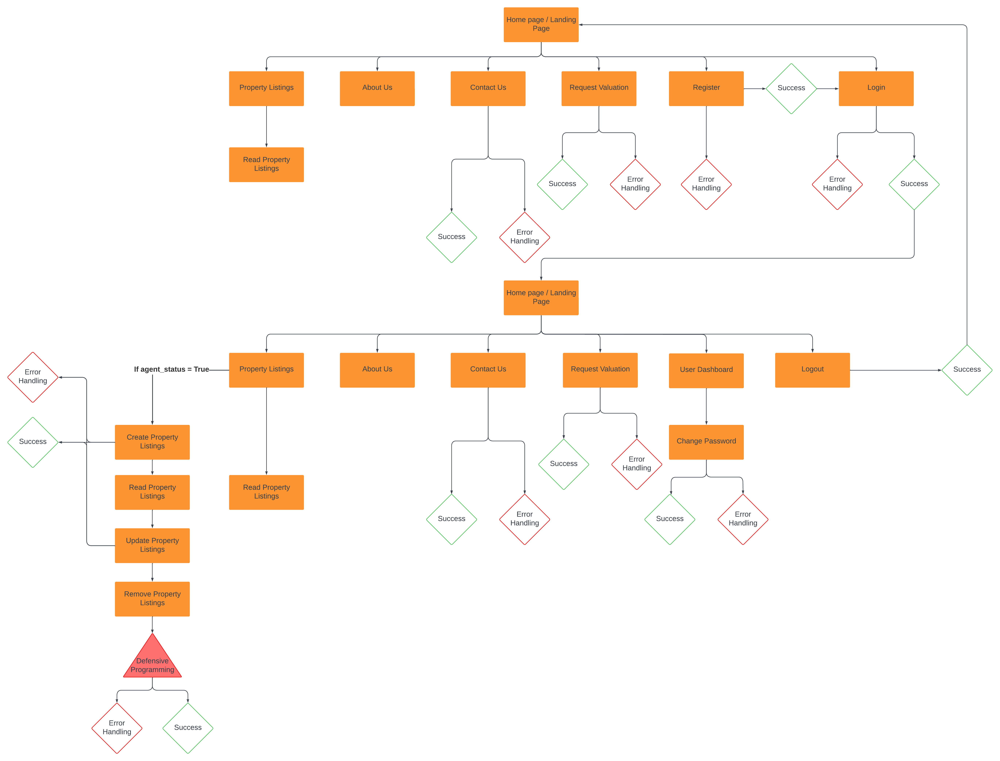

# Apex Estates

Image of Site to go here!

Apex Estates is tailored for those in pursuit of luxury living in London, providing a curated selection of homes with personalized features for an unparalleled experience.

Live site: Link to go here!

## Contents

[Planning](#planning)

- [The Strategy Plane](#the-strategy-plane)

- [The Scope Plane](#the-scope-plane)

- [The Structure Plane](#the-structure-plane)

- [The Skeleton Plane](#the-skeleton-plane)

- [The Surface Plane](#the-surface-plane)

## Planning

### The Strategy Plane

#### Product Description:

- Apex Estates is a distinguished online platform serving as an extension of a premier estate agency specializing in luxury housing in London.

- The website acts as an upscale estate agent platform, presenting a curated collection of high-end residences for potential buyers.

- Users can seamlessly explore luxury property listings, save preferred listings, request validations, and engage in a sophisticated online experience tailored for property transactions.

#### Target Audence:

- The primary audience for Apex Estates consists of individuals interested in buying luxury properties in London.

- The platform caters to a diverse clientele, including professionals, young families, and those seeking upscale residences with the dedicated support of a reputable estate agency.

#### Problem Statement:

In the competitive landscape of the London luxury real estate market, potential property buyers and renters face challenges in finding a platform that offers a diverse selection of upscale residences while maintaining a personalized and inclusive approach. Existing options may lack inclusivity and may not adequately cater to the varying preferences and budgets of individuals seeking luxury living spaces. Additionally, there is a need for a trustworthy estate agency platform that provides expert guidance and validation services to instill confidence in the legitimacy of listed properties.

#### Project Aim:

The primary aim of the Apex Estates project is to address the challenges in the London luxury real estate market by creating an online estate agency platform focused on facilitating the purchase of high-end residences. The platform will provide an inclusive and welcoming experience for a diverse range of clients, including professionals, young families, and individuals seeking to buy upscale living spaces. By curating a varied selection of premium properties and offering personalized consultations, the project aims to become the preferred destination for those looking to purchase luxury homes. Through this, Apex Estates seeks to redefine the standards of service in the upscale property market, fostering trust and satisfaction among clients seeking to make a significant investment in the London real estate scene.

### The Scope Plane

When crafting our site, we meticulously detail user stories and prioritize the development of essential components using the MoSCoW method. Guided by this approach, we carefully design every aspect with users in mind, ensuring that each feature serves a distinct purpose and enriches the overall user experience. Our focus on must-have and should-have requirements forms the foundation of our development strategy, allowing us to align seamlessly with the vision of Apex Estates. Through organized sprints and thoughtfully crafted epics, we are dedicated to creating a dynamic and user-centric online environment that sets the standard for luxury real estate exploration in London.

#### Sprint 1: Basic User Functionality

Epic 1: User Authentication

- User Story #2: User Registration
    - As a **New User** I can **Register an Account** so that **I can Login to the site**
- User Story #3: User Login
    - As a **Registered User** I can **Login using my email and password** so that **access the site securely using my account**
- User Story #4: User Logout
    - As a **Logged In User** I can **Logout** so that **I can keep my account secure.**

#### Sprint 2: Property Management

Epic 2: Property CRUD Operations

- User Story #5: Agent Status
    - As a **Sales Agent** I can **have the agent status** so that **I have full CRUD access over properties.**
- User Story #6: Create Properties
    - As a **Sales Agent** I can **Create property listings** so that **we can display current property listings**
- User Story #7: Update Properties
    - As a **Sales Agent** I can **Update property listings** so that **I can change / keep listings up to date.**
- User Story #8: Remove Properties
    - As a **Sales Agent** I can **Remove/Delete properties** so that **I can keep the site up to date with current sales.**
- User Story #9: Read Property Listings
    - As a **Site User** I can **Read property listings** so that **I can explore current property listings**

#### Sprint 3: Property Listings and Dashboard

Epic 3: New User Experience

- User Story #18: Landing Page
    - As a **Site User** I can **access the landing/home page** so that **I can navigate to other parts of the site**
- User Story #1: View Paginated Property Lists
    - As a **User** I can **see a paginated list of properties for sale** so that **I can select which one I would like to look at.**

Epic 4: User Dashboard and Favorites

- User Story #10: Favorite Properties
    - As a **User** I can **favourite properties** so that **I can easily return to my favourite property listings**
- User Story #11: User Dashboard
    - As a **Signed-In User** I can **Display my personal dashboard** so that **I can display my favourite properties**

#### Sprint 4: Additional Features

Epic 5: Additional User Functionality

- User Story #12: Password Reset
    - As a **User** I can **Reset my password** so that **I can access my account if I have forgotten it or my password is no longer secure**
- User Story #13: Valuation Request
    - As a **Potential Seller** I can **Request a Valuation** so that **I can have my property valued**
- User Story #14: Property Search
    - As a **Site User** I can **Search Properties** so that **find what I am looking for**
- User Story #16: About Us Page
    - As a **Site User** I can **access an about us page** so that **I can learn more about the company**
- User Story #17: Contact Us Page
    - As a **Site User** I can **Access a Contact us page** so that **I can find out ways to get in contact or find the location of the office**

 

By following this approach, we ensure that our development efforts are organized, focused, and aligned with the core objectives of Apex Estates. Each sprint builds upon the previous one, incrementally enhancing the platform's functionality and delivering tangible value to our users.

### The Structure Plane

We meticulously outline the architectural framework and navigation flow of our website to ensure a seamless user experience. The site follows a modern MVC (Model-View-Controller) architecture, with a robust front-end built using HTML, CSS, and JavaScript for dynamic interactions. Our back-end leverages Django, a powerful Python framework, to handle data management, user authentication, and CRUD operations for property listings. Navigation throughout the site is intuitive, with a hierarchical structure starting from the engaging landing page, guiding users to explore property listings, view their personalized dashboard, and access essential pages like the About Us and Contact Us sections.

Database info here

### The Skeleton Plane

### The Surface Plane