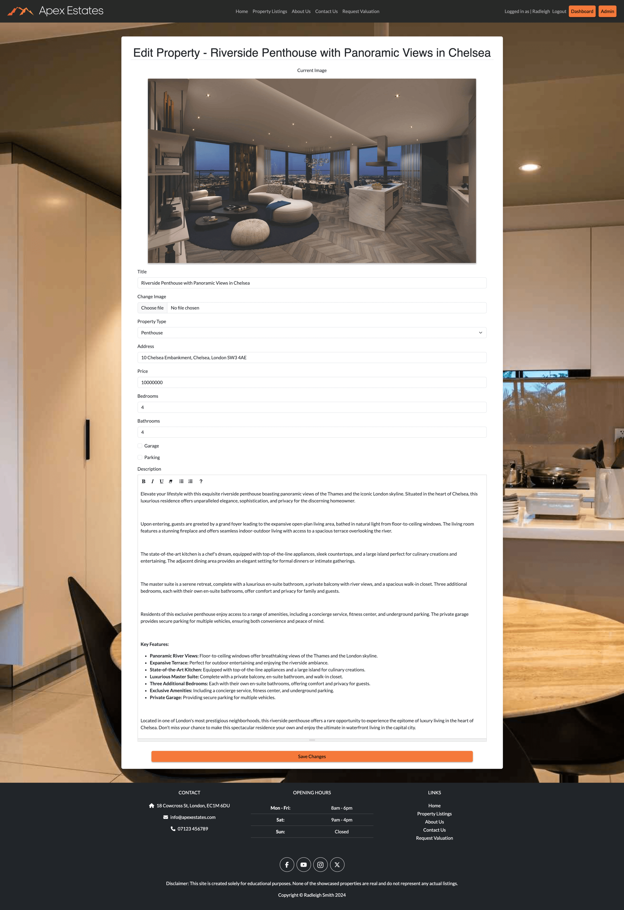
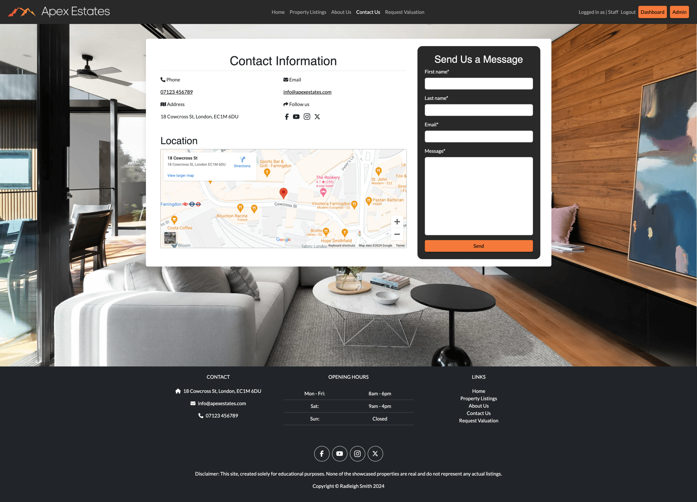
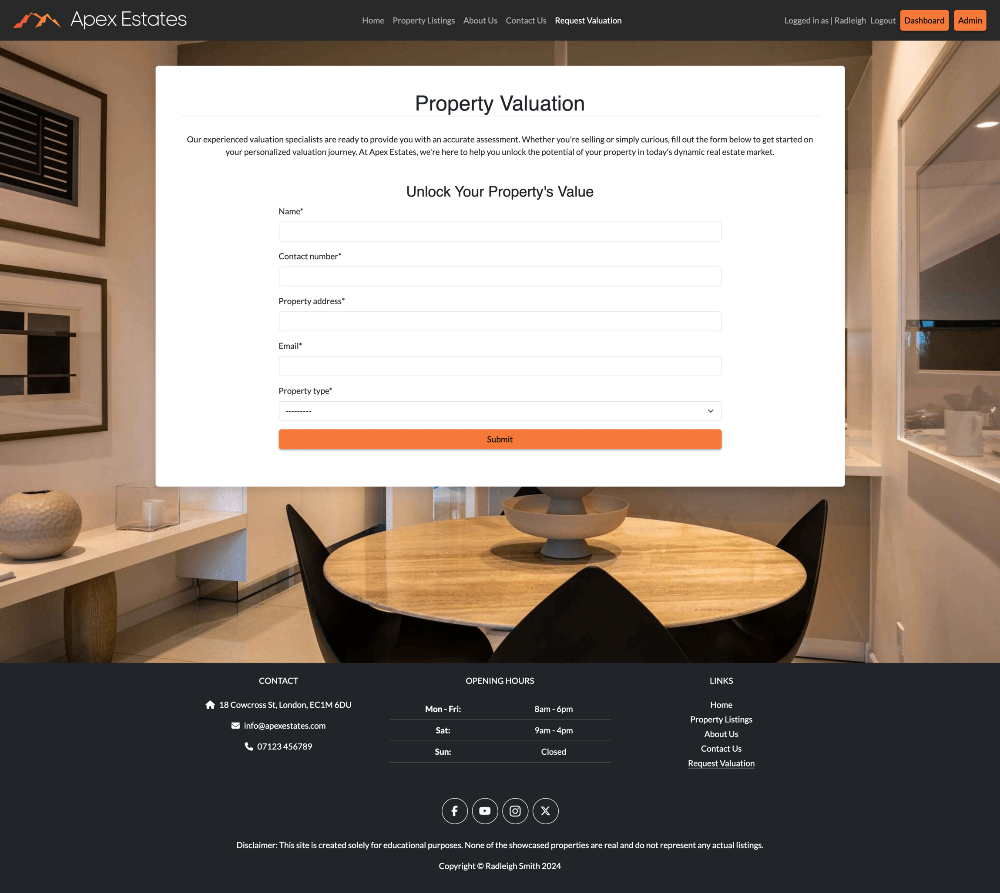
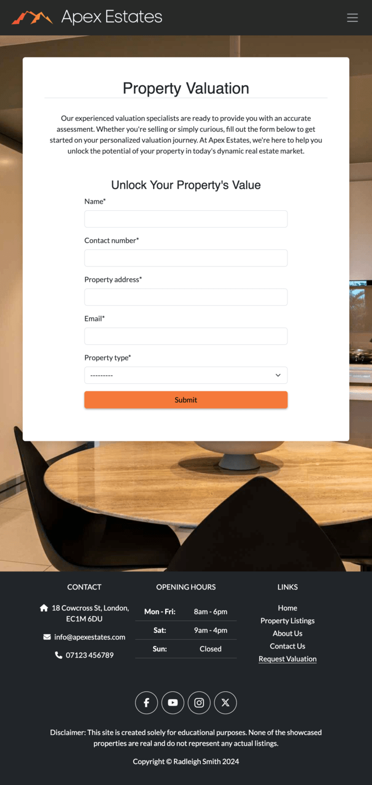

# Apex Estates

Image of Site to go here!

Apex Estates is tailored for those in pursuit of luxury living in London, providing a curated selection of homes with personalized features for an unparalleled experience.

Live site: Link to go here!

## Contents

[Planning](#planning)

- [The Strategy Plane](#the-strategy-plane)

- [The Scope Plane](#the-scope-plane)

- [The Structure Plane](#the-structure-plane)

- [The Skeleton Plane](#the-skeleton-plane)

- [The Surface Plane](#the-surface-plane)

[Features](#features)

- [Current Features](#current-features)

- [Future Features](#future-features)

[Languages](#languages)

[Frameworks](#frameworks)

[Libraries](#libraries)

[Testing](#testing)

[Bugs & Fixes](#bugs--fixes)

[Deployment](#deployment)

[Credits](#credits)

## Planning

### The Strategy Plane

#### Product Description:

- Apex Estates is a distinguished online platform serving as an extension of a premier estate agency specializing in luxury housing in London.

- The website acts as an upscale estate agent platform, presenting a curated collection of high-end residences for potential buyers.

- Users can seamlessly explore luxury property listings, save preferred listings, request validations, and engage in a sophisticated online experience tailored for property transactions.

#### Target Audence:

- The primary audience for Apex Estates consists of individuals interested in buying luxury properties in London.

- The platform caters to a diverse clientele, including professionals, young families, and those seeking upscale residences with the dedicated support of a reputable estate agency.

#### Problem Statement:

In the competitive landscape of the London luxury real estate market, potential property buyers and renters face challenges in finding a platform that offers a diverse selection of upscale residences while maintaining a personalized and inclusive approach. Existing options may lack inclusivity and may not adequately cater to the varying preferences and budgets of individuals seeking luxury living spaces. Additionally, there is a need for a trustworthy estate agency platform that provides expert guidance and validation services to instill confidence in the legitimacy of listed properties.

#### Project Aim:

The primary aim of the Apex Estates project is to address the challenges in the London luxury real estate market by creating an online estate agency platform focused on facilitating the purchase of high-end residences. The platform will provide an inclusive and welcoming experience for a diverse range of clients, including professionals, young families, and individuals seeking to buy upscale living spaces. By curating a varied selection of premium properties and offering personalized consultations, the project aims to become the preferred destination for those looking to purchase luxury homes. Through this, Apex Estates seeks to redefine the standards of service in the upscale property market, fostering trust and satisfaction among clients seeking to make a significant investment in the London real estate scene.

### The Scope Plane

When crafting our site, we meticulously detail user stories and prioritize the development of essential components using the MoSCoW method. Guided by this approach, we carefully design every aspect with users in mind, ensuring that each feature serves a distinct purpose and enriches the overall user experience. Our focus on must-have and should-have requirements forms the foundation of our development strategy, allowing us to align seamlessly with the vision of Apex Estates. Through organized sprints and thoughtfully crafted epics, we are dedicated to creating a dynamic and user-centric online environment that sets the standard for luxury real estate exploration in London.

#### Sprint 1: Foundational Functionality

Epic 1: User Authentication

| User Story # | Title                   | Story (Content)                                                    | MoSCoW     | Story Points |
|--------------|-------------------------|--------------------------------------------------------------------|------------|--------------|
| 2            | User Registration       | As a New User I can Register an Account so that I can Login to the site | Must Have | 3            |
| 3            | User Login              | As a Registered User I can Login using my email and password so that access the site securely using my account | Must Have | 2            |
| 4            | User Logout             | As a Logged In User I can Logout so that I can keep my account secure. | Must Have | 1            |

Epic 2: User Navigation

| User Story # | Title                   | Story (Content)                                                    | MoSCoW     | Story Points |
|--------------|-------------------------|--------------------------------------------------------------------|------------|--------------|
| 26           | Navbar                  | As a Site User I can expect a navbar so that I can easily and intuitively navigate round the site | Must Have | 3            |
| 27           | Footer                  | As a User I can expect a footer so that I can access important information and links regardless of my position on the webpage. | Must Have | 2            |

#### Sprint 2: Property App

Epic 3: Property Management

| User Story # | Title                   | Story (Content)                                                    | MoSCoW     | Story Points |
|--------------|-------------------------|--------------------------------------------------------------------|------------|--------------|
| 5            | Agent Status            | As a Sales Agent I can have the agent status so that I have full CRUD access over properties and can view/delete messages and valuations | Must Have | 5            |
| 6            | Create Properties       | As a Sales Agent I can Create property listings so that we can display current property listings | Must Have | 8            |
| 7            | Update Properties       | As a Sales Agent I can Update property listings so that I can change / keep listings up to date | Must Have | 5            |
| 8            | Remove Properties       | As a Sales Agent I can Remove/Delete properties so that I can keep the site up to date with current sales. | Must Have | 3            |

Epic 4: Property Display

| User Story # | Title                   | Story (Content)                                                    | MoSCoW     | Story Points |
|--------------|-------------------------|--------------------------------------------------------------------|------------|--------------|
| 1            | View Paginated Property Lists | As a User I can see a paginated list of properties for sale so that I can select which one I would like to look at. | Must Have | 3            |
| 9            | Read Property Listings  | As a Site User I can Read property listings so that I can explore current property listings | Must Have | 2            |

#### Sprint 3: User Experience

Epic 5: User Experience

| User Story # | Title                   | Story (Content)                                                    | MoSCoW     | Story Points |
|--------------|-------------------------|--------------------------------------------------------------------|------------|--------------|
| 18           | Landing Page            | As a Site User I can access the landing/home page so that I can navigate to other parts of the site | Must Have | 3            |
| 16           | About Us Page           | As a Site User I can access an about us page so that I can learn more about the company | Must Have | 2            |
| 17           | Contact Us Page         | As a Site User I can Access a Contact us page so that I can find out ways to get in contact, send a message or find the location of the office | Must Have | 2            |
| 10           | Favourite Properties    | As a User I can favourite properties so that I can easily return to my favourite property listings | Should Have | 3            |
| 11           | User Dashboard          | As a Signed-In User I can Display my personal dashboard so that I can display my favourite properties | Should Have | 5            |

#### Sprint 4: Additional Functionality & Product Refinement

Epic 6: Additional User Functionality

| User Story # | Title                   | Story (Content)                                                    | MoSCoW     | Story Points |
|--------------|-------------------------|--------------------------------------------------------------------|------------|--------------|
| 25           | Agent Admin Dashboard   | As a Agent I can Display a admin dashboard so that I can read through user messages and valuation request and delete them once actioned | Should Have | 5            |
| 13           | Valuation Request       | As a Potential Seller I can Request a Valuation so that I can have my property valued | Should Have | 3            |
| 19           | Apply to Newsletter     | As a Site User I can Apply to the newsletter so that I can keep up to date with Apex Estates latest news | Could Have | 2          |
| 22           | User Messages           | As a Site User I can send agents a message so that I can receive personalised assistance with my enquiries | Could Have | 3          |

#### Not Included in This Release

For further details regarding this section, please refer to the [Future Features](#future-features) section for additional information and insights.

Not Included User Stories

| User Story # | Title                   | Story (Content)                                                    | 
|--------------|-------------------------|--------------------------------------------------------------------|
| 12           | Password Reset          | As a User I can Reset my password so that I can access my account if I have forgotten it or my password is no longer secure |
| 14           | Property Search         | As a Site User I can Search Properties so that find what I am looking for. |
| 15           | Property Filter         | As a Site User I can filter property listings so that a number of different properties based on my filters |
| 20           | Write Newsletter        | As a Agent I can Write a newsletter so that I can keep subscribed users up-to-date with the latest news |
| 21           | Live Text Chat          | As a Signed In User I can have a live chat so that I can talk to an agent via text chat live |
| 23           | Interactive Property Listing Map | As a User I can use an interactive map so that I can better understand the location of properties and search by using a map |
| 24           | Image Gallery for property listings | As a User I can navigate through a selection of images so that I can better understand the property im looking at |
| 28           | Change Email            | As a Authenticated User I can change my email so that I can keep my account information up-to-date. |
| 29           | For Sale, Sold, Unpublished Listings | As a Agent I can set the state of a listing so that I can users informed about the availability and status of properties. |

 

By following this approach, we ensure that our development efforts are organized, focused, and aligned with the core objectives of Apex Estates. Each sprint builds upon the previous one, incrementally enhancing the platform's functionality and delivering tangible value to our users.

### The Structure Plane

#### Site Map

This diagram provides a structured overview of our platform's architecture and user navigation. Created using [Lucidchart](https://www.lucidchart.com/), it serves as a clear visualization of the pathways and interactions within the system.

Each element within the diagram is positioned to depict the flow of information and user movement.

---
#### Database Plan

This diagram offers a comprehensive overview of our database structure, crafted using [DrawSQL](https://drawsql.app/). It provides a visual representation of the relationships between various entities and the flow of data within our system.

### The Skeleton Plane

#### Wireframes

We created wireframes for desktop, tablet, and mobile views to provide a visual representation of our website's layout and design across different devices. Wireframes serve as a blueprint for our site's structure, illustrating the placement of elements, navigation flow, and overall user interface design. By creating wireframes, we can effectively communicate our design concepts and collaborate with stakeholders to gather feedback and make informed decisions before moving into the development phase.

We utilized [Uizard](https://uizard.io/), an innovative wireframing tool, to streamline the wireframing process and accelerate our design iteration cycles. [Uizard's](https://uizard.io/) intuitive interface enable us to quickly translate our ideas into tangible wireframes, saving time and effort in the design phase. With [Uizard](https://uizard.io/), we can easily experiment with different layouts, iterate on design variations, and visualize how our website will look and function across various devices.

Landing / Home Page

Desktop

Tablet

 

Mobile

 

Property Listings Page

Desktop

Tablet

 

Mobile

 

Property Detail Page

Desktop

Tablet

 

Mobile

 

About Us Page

Desktop

Tablet

Mobile

 
Contact Us Page

Desktop

Tablet

Mobile

 
Request Valuation Page

Desktop

Tablet

Mobile

 
Login Page

Desktop

Tablet

Mobile

 
Register Page

Desktop

Tablet

Mobile

 
Dashboard Page

Desktop

Tablet

Mobile

 
Admin Dashboard

Desktop

### The Surface Plane

**Colour Scheme**

In the color scheme section of our skeleton plane, we've carefully selected a palette that reflects our design goals and enhances the overall user experience. We've opted for a clean and minimalist approach, with a main background color of white (#ffffff) to provide a spacious and uncluttered feel to our website. To ensure readability and contrast, we're using black (#000000) for text elements, providing a sharp and easily distinguishable appearance against the white background.

For navigation and footer elements, we've chosen a dark gray shade (#282928) to create a subtle yet distinct separation from the main content area. This color adds depth and visual hierarchy to our design, guiding users' attention to important navigation links and footer information.

To draw attention to key actions and encourage user engagement, we're incorporating an eye-catching orange hue (#F5793A) for call-to-action items. This vibrant color adds warmth and energy to our design, effectively highlighting important buttons and prompts throughout the website.

Finally, to introduce subtle variation and soften the overall look, we're introducing an off-white shade (#E0E0DB) as a contrast to the pure white background. This color adds depth and dimension to our design, creating visual interest without overwhelming the user interface.

Overall, our carefully curated color scheme aims to create a harmonious and visually appealing experience for our users, balancing contrast, readability, and engagement throughout the website.

In order to ensure that our chosen color scheme meets accessibility standards and provides optimal readability for all users, we employed a contrast grid from [eightshapes](https://contrast-grid.eightshapes.com/) to evaluate the contrast ratios between text and background colors. This grid allows us to assess the color combinations used throughout the website and verify that they adhere to accessibility guidelines.

The contrast grid provides a systematic approach to evaluating color combinations, helping us to create a design that is inclusive and accessible to all users, including those with visual impairments or disabilities.

**Typography**

In crafting our website's visual identity, we've carefully curated typography to ensure optimal readability and aesthetic appeal. Our choice of Montserrat for headings exudes a sense of modernity and sophistication, with its sleek lines and bold presence commanding attention. This typeface adds a touch of elegance to our headers, making them stand out while maintaining readability across different devices and screen sizes.

Complementing Montserrat, we've selected Lato for body text, known for its versatility and legibility. Lato's clean and rounded letterforms provide a comfortable reading experience, enhancing comprehension and engagement with our content. Whether users are browsing lengthy descriptions or informative articles, Lato ensures clarity and ease of reading, contributing to a seamless user experience.

## Features

### Current Features

#### Navbar

Our navigation bar is meticulously crafted to enhance user experience at every turn. It gracefully combines aesthetic appeal with practical functionality, featuring transparency on the homepage for a captivating touch against the hero image, while adopting a sleek dark grey color scheme on other pages to maintain consistency. Catering to different user roles, it offers tailored navigation options, ensuring seamless access to relevant features and information based on individual needs and preferences.

Navbar Screenshots

##### Navbar Homepage

##### Navbar Homepage User Logged In

##### Navbar Homepage Admin Logged In

##### Navbar all other pages User Logged In

##### Navbar Collapsed

##### Navbar Offcanvas

##### Navbar Offcanvas User Logged In

##### Navbar Offcanvas Admin Logged In

---

#### Footer

Our footer is a comprehensive hub of essential information and connectivity, featuring:

Features:

- **Contact section:** Providing our address, email, and phone number.

- **Opening hours:** Offering clarity on our service availability.

- **Links section:** Curated resources for seamless navigation.

- **Social media links:** Allowing user to connect with us across different sites.

- **Copyright and educational disclaimer.**

Footer Screenshots

##### Footer Desktop

##### Footer Tablet

##### Footer Mobile

---

#### Landing Page

The landing page serves as the initial point of entry for users visiting our site. It features several design elements that reflect the premium nature of our platform. Our hero image, showcasing an orange sunset over the London skyline, was selected for its incorporation of our site's colors, which are echoed in our call-to-action buttons throughout the site.

As users scroll down the page, they encounter the 'Latest Properties' section, displaying the four most recently listed properties. Users can click on these cards to access more details or even add them to their favorites if they're logged in. Below this, we present another call-to-action prompting users to explore our listings page, as this is the primary function of our site.

We also encourage users who own properties to consider requesting a free valuation through our platform. Additionally, we feature a review of our company, followed by a signup form for our newsletter, providing users with the opportunity to stay updated on the latest developments and offerings.

Features:

- **Premium design elements:** Hero image featuring an orange sunset over the London skyline, echoing site colors.

- **Latest Properties section:** Displaying four newest listings with clickable cards for easy access.

- **Call-to-action for Listings page:** Directing users to explore our primary site function.

- **Free valuation prompt:** Encouraging property owners to request a valuation through our platform.

- **Company review:** Providing users with insight into our company's reputation and credibility.

- **Newsletter signup form:** Allowing users to stay updated on the latest developments and offerings.

Landing Page Screenshots

##### Landing Page Desktop

##### Landing Page Tablet

##### Landing Page Mobile

---

#### Property Listings

The Property Listings page stands as the cornerstone of our platform, fulfilling our core mission of providing users with an extensive array of properties available for sale. With a user-centric design featuring eight listings per page, our interface ensures clarity and ease of navigation. Pagination buttons are intelligently integrated to appear only when needed, streamlining the browsing experience. For logged-in users, the option to favorite properties directly from the listings page enhances interaction and facilitates efficient organization of preferences. Additionally, agents and administrators can seamlessly add new property listings, ensuring our database remains up-to-date with the latest offerings.

Features:

- **Comprehensive Listings:** Each page presents users with eight meticulously curated property listings or cards, offering a rich selection while maintaining clarity and ease of navigation.

- **Pagination:** Navigation is optimized through an intuitive pagination system. Pagination buttons dynamically appear only when necessary, ensuring a fluid browsing experience without unnecessary clutter.

- **User Interaction:** Logged-in users benefit from seamless interaction by favoriting properties directly from the listings page. This feature simplifies the process of saving and organizing preferred properties for future reference.

- **Agent/Admin Privileges:** Agents and administrators enjoy the convenience of adding new property listings directly from this centralized hub. This capability ensures our listings remain up-to-date and reflective of the latest offerings in the market.

Property Listings Screenshots

##### Property Listings Desktop

##### Property Listings Desktop User Logged In

##### Property Listings Desktop Admin Logged In

##### Property Listings Desktop Admin Logged In

##### Property Listings Desktop Admin Logged In

---

#### Property Details

The Property Detail Page offers users a deeper exploration of their selected property, accessed by interacting with any property card across the site. Upon arrival, users are greeted with a comprehensive overview, including a larger feature image capturing the essence of the property, along with essential details such as price, listed date, and property type. Additionally, users can conveniently favorite the property for future reference. A concise summary provides key information, including the property's type, number of bedrooms and bathrooms, and whether it offers parking or a garage. Further details are provided in the description section, styled using Summernote, offering a rich and engaging narrative that paints a vivid picture of the property's unique features and attributes. If the user is an admin or an agent, they are able to edit or delete the relevant property listing. If the agent or admin selects delete, it will prompt for confirmation to ensure they are sure they want to delete the property.

**Features:**

- **Detailed Overview:** Presents users with a comprehensive look at their chosen property, featuring a larger feature image, price, listed date, and property type.
  
- **Convenient Interaction:** Users can easily favorite the property directly from the page for future reference.
  
- **Concise Summary:** Highlights essential information including property type, bedroom and bathroom count, and parking/garage availability.
  
- **Styled Description:** Utilizes Summernote to present a richly styled description, enhancing the narrative and showcasing the property's unique features and attributes.
  
- **Admin/Agent Functionality:** Provides admins and agents with convenient access to edit and delete property listings directly from this page, ensuring efficient management and updates.

Property Details Screenshots

##### Property Details Page Desktop

##### Property Details Page Desktop User Logged In

##### Property Details Page Desktop Admin Logged In

##### Property Details Page Desktop Deletion Example

##### Property Details Page Tablet

##### Property Details Page Mobile

---

#### Create Property Listing Page

The Create Property page is accessible only to admins and agents. This feature allows these users to create a listing in the database directly from the front end. Once the listing is created and submitted, the information is immediately uploaded to the database. Consequently, the new listing becomes visible on the user's listings page, ensuring that the property is available for viewing by potential buyers without delay.

- **Exclusive Access:** Limited to admins and agents, providing them with the ability to create property listings.

- **Seamless Integration:** Enables users to input property details directly on the front end, with immediate upload to the database upon submission.

- **Image Upload:** Integration with Cloudinary allows users to upload property images easily, enhancing listing visual appeal and attractiveness.

- **Rich Description:** Utilizes Summernote for the property description field, enabling users to format and style descriptions with ease.

Create Property Listings Screenshots

##### Create Property Listing Desktop

##### Create Property Listing Tablet

##### Create Property Listing Mobile

---

#### Edit Property Listing Page

The Edit Property Listing feature empowers admins and agents with exclusive access to efficiently manage property listings directly from the front end. Leveraging this functionality, users can seamlessly modify property details, ensuring accuracy and relevance in real-time. With the convenience of front-end editing, updates to property information are promptly reflected in the database, guaranteeing consistency across all platforms. Integrated with Cloudinary, users can effortlessly change the featured image, enhancing the visual appeal of listings. Additionally, the use of Summernote for description editing facilitates the creation of rich, formatted property descriptions, enabling agents to showcase the unique features and attributes of each listing effectively.

Features:

- **Admin/Agent Privilege:** Reserved for admins and agents, granting them exclusive access to edit property listings.

- **Front-End Editing:** Allows users to modify property details directly on the front end, facilitating convenient updates.

- **Seamless Database Integration:** Changes made to property listings are immediately reflected in the database upon submission.

- **Enhanced Functionality:** Provides flexibility for admins and agents to manage property listings efficiently, ensuring accuracy and relevance.

Edit Property Listings Screenshots

##### Edit Property Listing Desktop

##### Edit Property Listing Tablet

##### Edit Property Listing Mobile

---

#### About Us

The About Us page provides insight into Apex Estates and its dedicated team of professionals. Here, visitors can learn about our company's mission, values, and commitment to excellence in the real estate industry.

About Us Page Screenshots

##### About Us Page Desktop

##### About Us Page Tablet

##### About Us Page Mobile

---

#### Contact Us

The Contact Us page serves as a hub for users to connect with Apex Estates through various channels. At the top of the page, visitors will find essential contact information, including email, phone number, address, and links to our social media profiles. Additionally, a Google Map integration provides users with a visual representation of our location. Below this section or to the side depending on screen size is a "Send Us a Message" form, which offers a convenient way for users to reach out to us directly. The form prompts users to provide their first name, last name, email address, and message, enabling seamless communication between our team and our clients. We strive to make it easy for users to get in touch with us, whether they have inquiries, feedback, or are interested in our services.

Features:

- **Comprehensive Contact Information:** Provides users with essential contact details, including email, phone number, address, and social media links, ensuring multiple channels for communication.

- **Interactive Google Map Integration:** Offers users a visual representation of our location, enhancing accessibility and providing easy navigation.

- **User-Friendly Message Form:** Enables users to send messages directly to Apex Estates by filling out a simple form with their first name, last name, email address, and message, facilitating efficient communication.

Contact Us Page Screenshots

##### Contact Us Page Desktop

##### Contact Us Page Tablet

##### Contact Us Page Mobile

---

#### Request Valuation

Our request valuation page features a simple form where users can input their name, contact number, property address, and email, along with the option to select their property type before submitting their information for valuation by an agent.

Request Valuation Page Screenshots

##### Request Valutation Page Desktop

##### Request Valutation Page Tablet

##### Request Valuation Page Mobile

---

#### Login

Our login page, powered by Django's built-in authentication system, offers a seamless login experience with fields for username and password, including a link if the user does not yet have an account to sign up.

Login Page Screenshots

##### Login Page Desktop

##### Login Page Tablet

##### Login Page Mobile

---

#### Register

Our register page offers a comprehensive registration process, featuring fields for first name, last name, email, and password with checks for password strength. Users can confidently create their accounts and proceed to registration with ease, while those with existing accounts can conveniently access the login page via a provided link.

Register Page Screenshots

##### Register Page Desktop

##### Register Page Tablet

##### Register Page Mobile

---

#### User Dashboard

Our user dashboard provides a seamless experience for users to access and manage their favorited properties. With an organized pagination system, users can effortlessly navigate through their favorite listings, with each page showcasing up to 4 property cards, ensuring a user-friendly experience

User Dashboard Screenshots

##### User Dashboard Desktop

##### User Dashboard Tablet

##### User Dashboard Mobile

---

#### Admin Dashboard

#### User Dashboard

Our admin dashboard is meticulously crafted for agents, equipping them with the tools to efficiently review and manage user messages and valuations. Embracing a responsive design philosophy, our dashboard dynamically adjusts its layout to accommodate smaller screens, enabling agents to stay informed and productive whether they're in the office or on the move.

Features

- Responsive table design ensures usability across all device sizes.

- Read and delete functionalities enable agents to manage user messages and valuation requests efficiently.

- Agents can conveniently favorite properties for easy tracking and reference.

Admin Dashboard Screenshots

##### User Dashboard Desktop

---

### Future Features

In this section we will outline upcoming improvements and features designed to enhance the platforms experience.

| Feature                               | Description                                                      |
|---------------------------------------|------------------------------------------------------------------|
| Password Reset                        | Users can reset their password conveniently from the login page or dashboard by receiving a verification email.  |
| Property Search                       | Enhances user experience on the property listings page by enabling location-based searches with filters for price range, bedrooms, and title.  |
| Property Filter                       | Provides users with the ability to refine property listings based on property type (e.g., apartment, semi-detached), streamlining their search process.  |
| Write Newsletter                      | Empowers agents to craft and distribute newsletters effortlessly using collected subscriber data, fostering engagement and communication with users.  |
| Live Text Chat                        | Facilitates real-time communication between users and agents via a user-friendly pop-up chat feature, offering immediate assistance and support. |
| Interactive Property Listings Map     | Introduces an interactive map view option on the property listings page, allowing users to explore listings spatially for a more immersive browsing experience. |
| Image Gallery for Property Listings   | Simplifies property exploration for users by enabling agents to upload multiple images for each listing, presenting them in an intuitive carousel format for easy navigation. |
| Change Email                          | Enhances user account management by enabling email address updates directly from the user dashboard, ensuring seamless control and customization of user information. |
| For Sale, Sold, Unpublished Listings  | Provides agents with comprehensive control over property listings, enabling them to mark properties as sold or unpublished as needed, thereby optimizing listing management and user experience. |
| Account Deletion                      | Allows users to permanently delete their account from the platform, providing a streamlined process for account management and data privacy. |

---

## Languages

HTML, CSS, JavaScript, Python

## Frameworks and Libraries

| Framework/Library       | Description                                      |
|-------------------------|--------------------------------------------------|
| asgiref                 | ASGI (Asynchronous Server Gateway Interface) - A low-level library for building ASGI applications. |
| bleach                  | HTML sanitizer - A tool for sanitizing and cleaning HTML input. |
| certifi                 | Python SSL certificate authority - A collection of CA certificates for Python SSL verification. |
| charset-normalizer      | Charset normalization - A library for normalizing and converting character encodings. |
| cloudinary              | Cloud-based image and video management - A platform for storing, managing, and delivering images and videos. |
| crispy-bootstrap5       | Bootstrap 5 integration for Django Crispy Forms - Simplifies integration of Bootstrap 5 styles with Django forms. |
| dj-database-url         | Database configuration helper for Django - Parses database connection URLs for Django applications. |
| Django                  | High-level Python web framework - A powerful web framework for building web applications in Python. |
| django-crispy-forms     | DRY forms for Django apps - Simplifies form rendering and validation in Django applications. |
| django-summernote       | WYSIWYG editor for Django - Integrates the Summernote What You See Is What You Get editor into Django forms. |
| gunicorn                | Python WSGI HTTP server - A Python HTTP server for running WSGI applications. |
| idna                    | Internationalized Domain Names in Applications - A library for handling IDNA (Internationalized Domain Names in Applications) encoding and decoding. |
| psycopg2                | PostgreSQL adapter for Python - Provides Python bindings for PostgreSQL database connections. |
| requests                | HTTP library for Python - Simplifies making HTTP requests in Python. |
| setuptools              | Library for packaging Python projects - Facilitates the distribution of Python packages. |
| six                     | Python 2 and 3 compatibility utilities - Provides utilities for writing code that is compatible with both Python 2 and Python 3. |
| sqlparse                | SQL parser for Python - Parses SQL queries and statements in Python. |
| urllib3                 | HTTP library for Python - Provides a Python HTTP client for making HTTP requests. |
| webencodings            | Character encoding aliases for Python - Provides character encoding aliases for Python applications. |
| whitenoise              | Static file serving for Python web applications - Simplifies serving static files in Python web applications. |
| Bootstrap 5             | Front-end framework for building responsive websites - A popular framework for building responsive and mobile-first websites. |
| jQuery 3.6.0            | JavaScript library for DOM manipulation - Simplifies DOM manipulation and event handling in JavaScript. |

## Testing

## Bugs & Fixes

## Deployment

## Credits