# Testing and Code Validation

## Contents

[Code Validation](#code-validation)

[Accessibility Testing](#accessibility-testing)

[User Story Testing](#user-story-testing)

[Lighthouse Testing](#Lighthouse-testing)

[Device Testing Testing](#device-testing)

## Code Validation

### HTML Validation

For our HTML Validation, we relied on the [W3C Markup Validation Service](https://validator.w3.org/). This invaluable tool enabled us to meticulously assess every aspect of our HTML code against the official standards established by the World Wide Web Consortium (W3C). Through this validation process, we ensured that our web pages adhere to the best practices of HTML syntax, structure, and semantics.

During our validation process, our pages underwent rigorous scrutiny, resulting in the identification of a few errors, all of which were promptly rectified. Each issue was addressed immediately, followed by a thorough retesting to ensure a seamless pass. However, it's worth noting that some non-critical errors associated with Summernote persisted, which unfortunately remain beyond our control. Despite this, we have strived to uphold the highest standards of quality assurance, guaranteeing an optimal browsing experience for our users.

| Template             | PASS/FAIL | NOTES                              |
|----------------------|-----------|------------------------------------|
| base.html            | PASS      | Successfully validated as part of the landing page. |
| header.html          | PASS      | Alt text added to offcanvas image. Removed trailing img tag and unnecessary span from list.  |
| footer.html          | PASS      | Removed trailing i tag.|
| index.html           | PASS      | |
| property_detail.html | PASS      | Removed duplicate paragraph tags from property description due to duplication with Summernote. |
| create_property.html | PASS      | Detected 9 non-critical errors related to Summernote, which are unfortunately beyond our control. |
| edit_property.html   | PASS      | Detected 9 non-critical errors related to Summernote, which are unfortunately beyond our control. |
| property_cards.html  | PASS      | Removed unused property favorite ID from cards.  |
| property_listings.html | PASS    | |
| about.html           | PASS      | |
| contact.html         | PASS      | Removed duplicate i tags from social media links. |
| valuation.html       | PASS      | |
| login.html           | PASS      | |
| sign_up.html         | PASS      | |
| dashboard.html       | PASS      | Successfully validated both Admin and User Dashboards. |
| 404.html             | PASS      | |
| 500.html             | PASS      | |

### CSS Validation

To ensure the quality and consistency of our website's styling, we utilized the (W3C CSS Validation Service)[https://jigsaw.w3.org/css-validator/]. This tool allowed us to thoroughly check our CSS code against established standards, ensuring it meets best practices and specifications.

During our CSS testing phase, we're pleased to report that no errors were detected in our CSS file. 

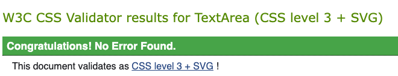

### Python Validation

### JavaScript Validation

---

## Accessibility Testing

When conducting accessibility testing, we employed the Chrome extension called Wave. This valuable tool helped us assess the accessibility of our website by highlighting any potential issues related to web content accessibility guidelines (WCAG). By utilizing Wave, we were able to identify areas where improvements could be made to enhance the accessibility of our website for all users, including those with disabilities.

Please see the table below outlining these:

| Template             | PASS/FAIL | Description             |
|----------------------|-----------|-------------------------|
| base.html            | PASS      | |
| header.html          | PASS      | |
| footer.html          | PASS      | |
| index.html           | PASS      | |
| property_detail.html | PASS      | Two alerts were identified. One alert concerned a potential heading on the paragraph element price tag, deliberately designed to emphasize the price and ensuring no impact on screen readers or accessibility, this was left. The other alert highlighted a skipped heading level, this issue was identified as being caused by Summernote and is beyond our control, yet it does not affect screen readers or accessibility.|
| create_property.html | PASS      | While the create property page passed accessibility testing, it encountered 1 error and 32 alerts. These issues were identified as being caused by Summernote integration rather than being likely attributed to it. Importantly, these issues, identified as being caused by Summernote, do not compromise user accessibility. |
| edit_property.html   | PASS      | The edit property page successfully passed accessibility testing, despite encountering 1 error and 32 alerts identified as being caused by Summernote integration. It's worth noting that these issues, caused by Summernote, do not hinder user accessibility.|
| property_cards.html  | PASS      | |
| property_listings.html | PASS    | |
| about.html           | PASS      | |
| contact.html         | PASS      | |
| valuation.html      | PASS      | |
| login.html           | PASS      | |
| sign_up.html         | PASS      | |
| dashboard.html       | PASS      | |
| 404.html             | PASS      | |
| 500.html             | PASS      | |

### WAVE Screenshots

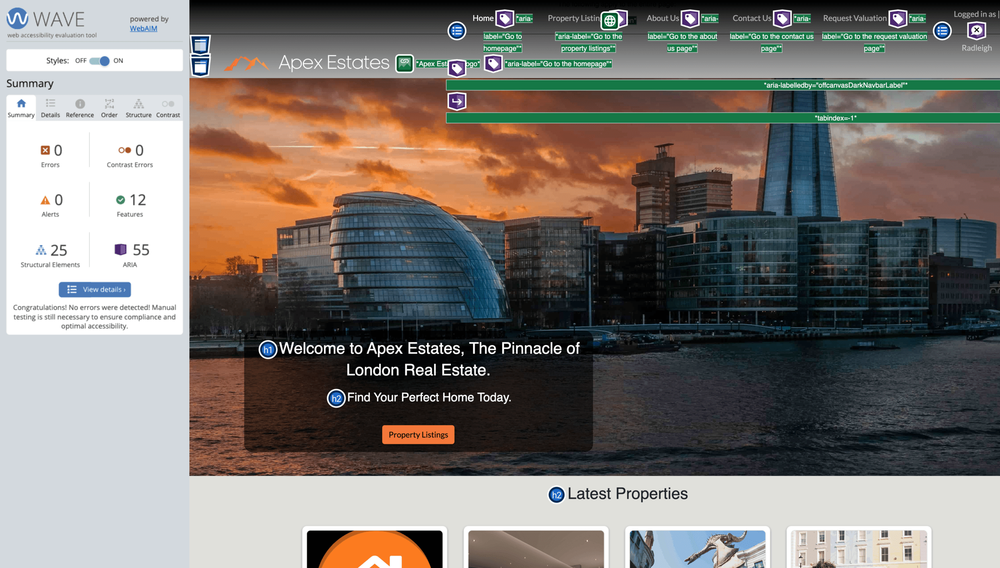

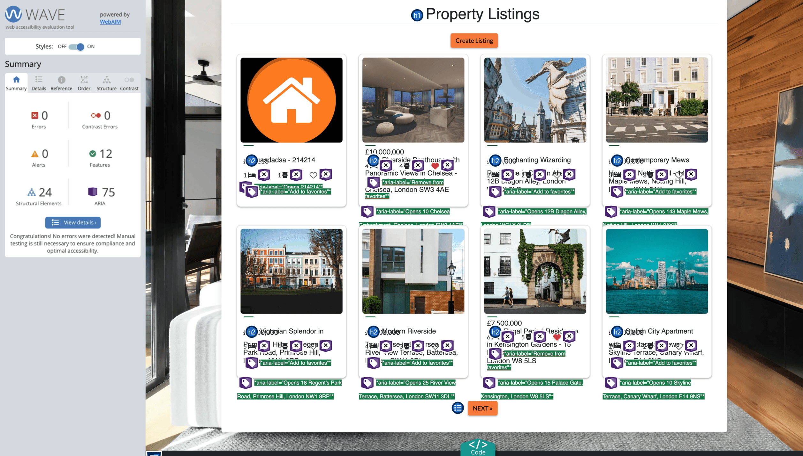

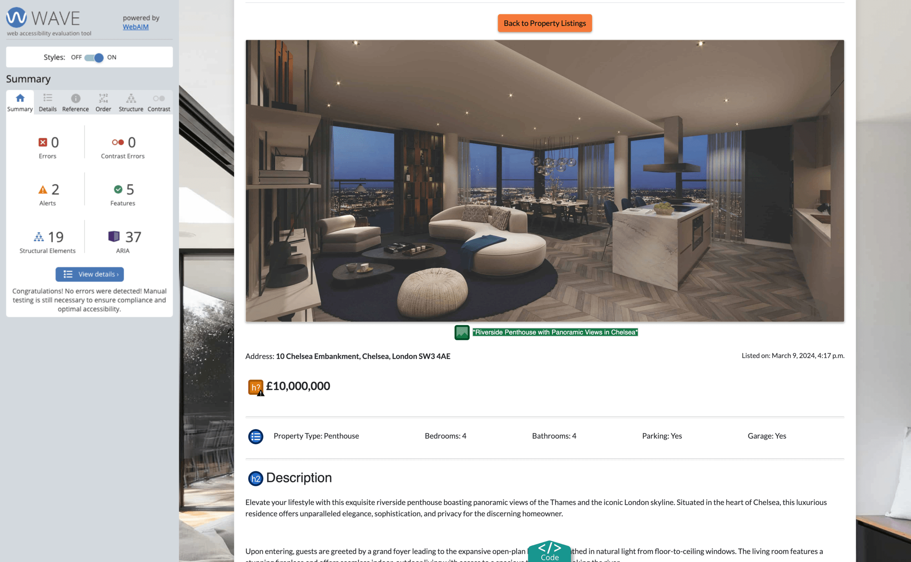

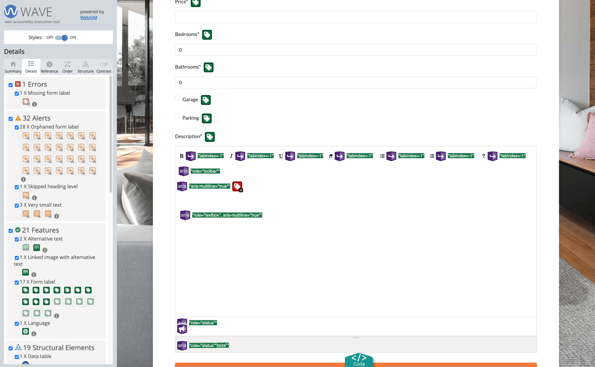

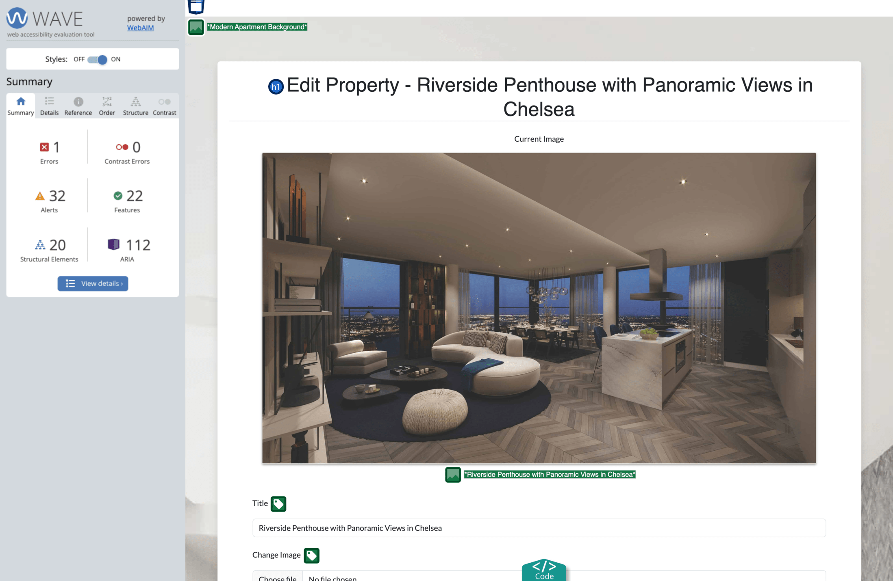

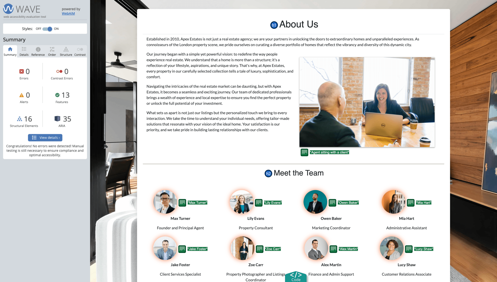

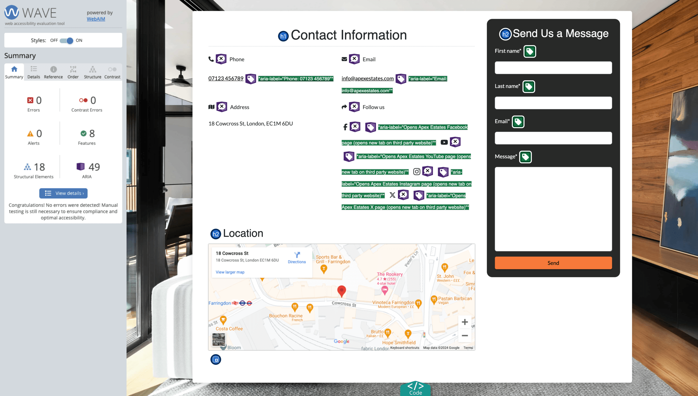

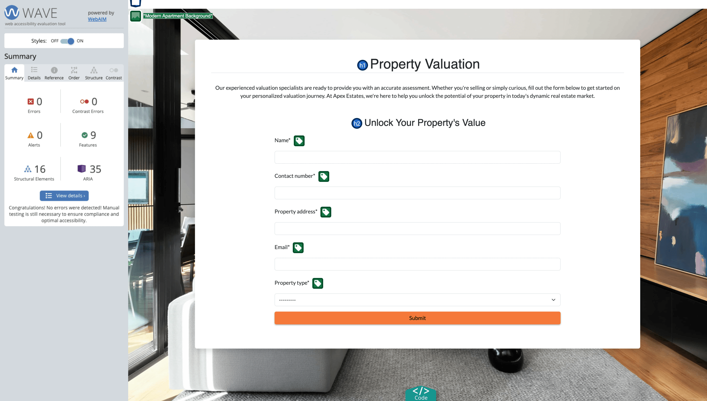

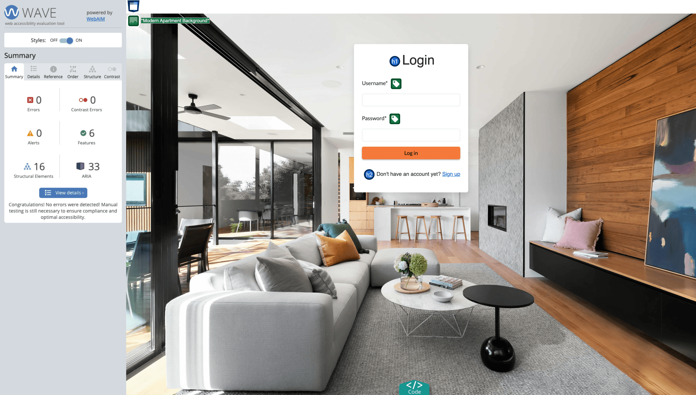

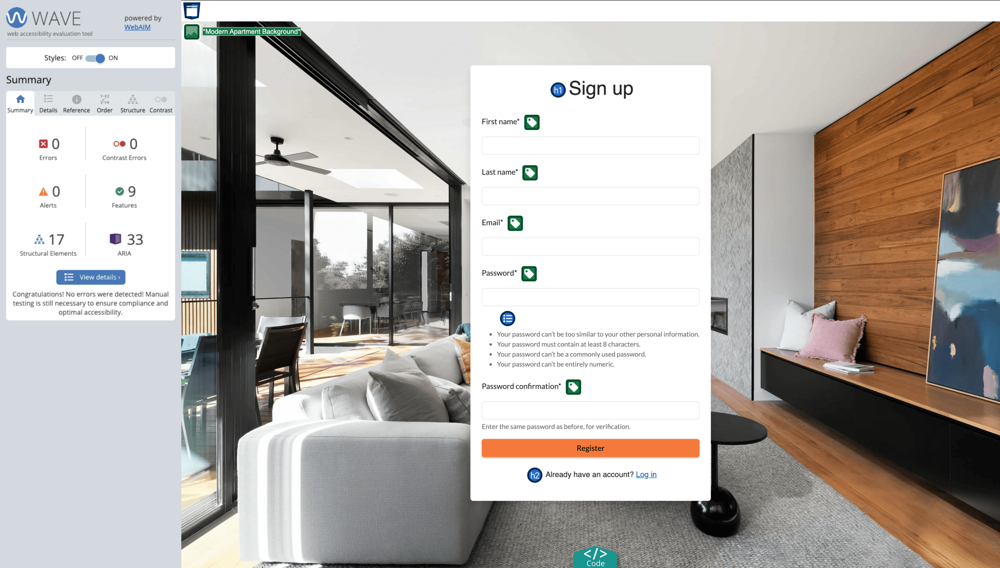

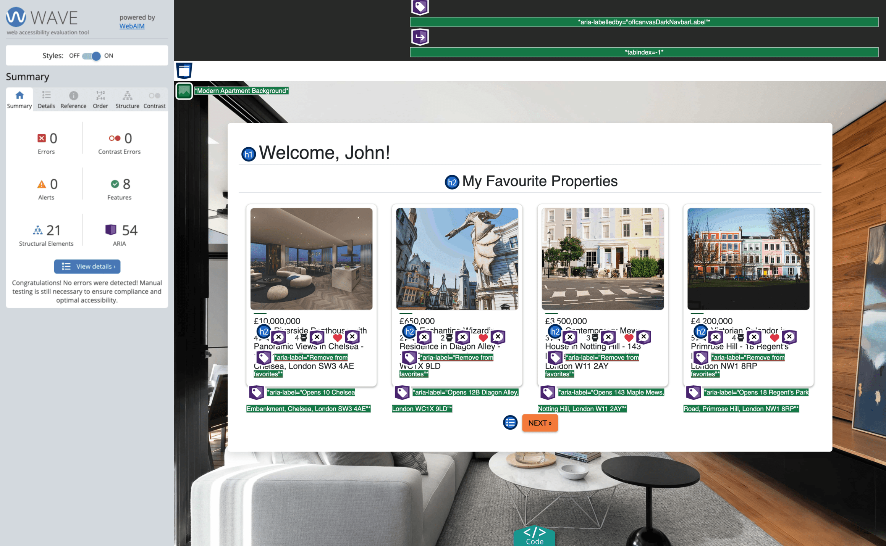

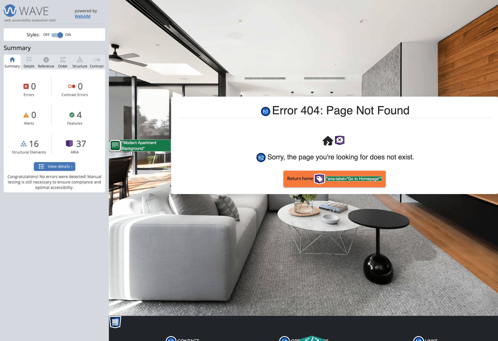

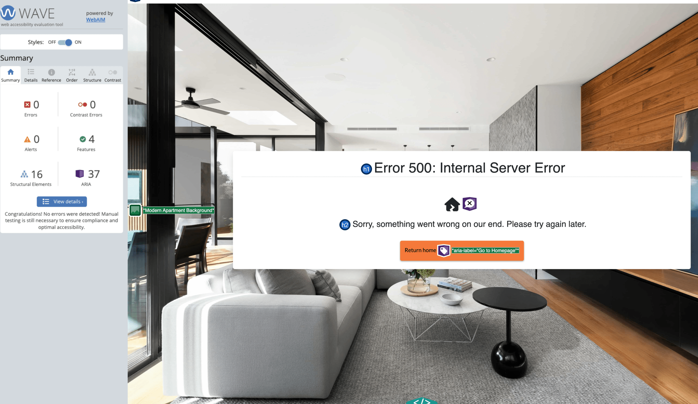

--- 

## User Story Testing

---

## Lighthouse Testing

---

## Device Testing