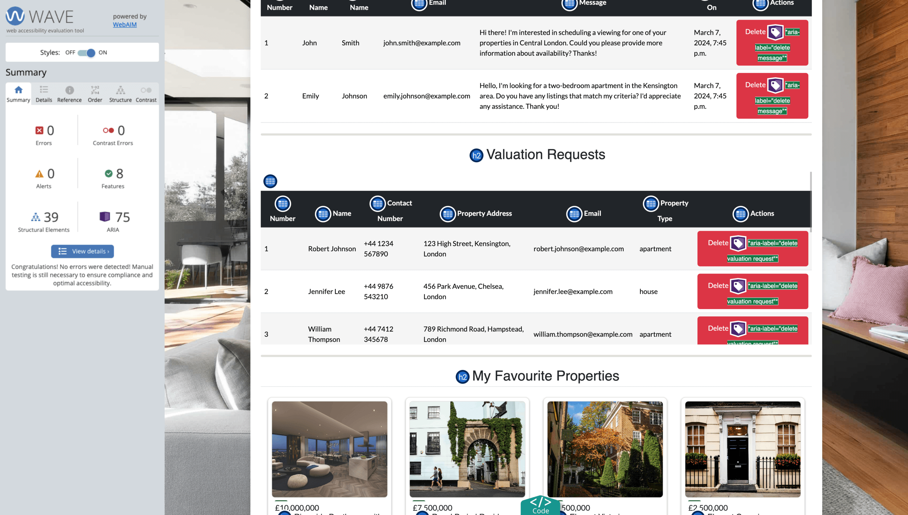

# Testing and Code Validation

[Return to README](README.md)

## Contents

[Code Validation](#code-validation)

[Accessibility Testing](#accessibility-testing)

[User Story Testing](#user-story-testing)

[Lighthouse Testing](#Lighthouse-testing)

[Device and Browser Testing Testing](#device-and-browser-testing)

## Code Validation

### HTML Validation

For our HTML Validation, we relied on the [W3C Markup Validation Service](https://validator.w3.org/). This invaluable tool enabled us to meticulously assess every aspect of our HTML code against the official standards established by the World Wide Web Consortium (W3C). Through this validation process, we ensured that our web pages adhere to the best practices of HTML syntax, structure, and semantics.

During our validation process, our pages underwent rigorous scrutiny, resulting in the identification of a few errors, all of which were promptly rectified. Each issue was addressed immediately, followed by a thorough retesting to ensure a seamless pass. However, it's worth noting that some non-critical errors associated with Summernote persisted, which unfortunately remain beyond our control. Despite this, we have strived to uphold the highest standards of quality assurance, guaranteeing an optimal browsing experience for our users.

| Template             | PASS/FAIL | NOTES                              |
|----------------------|-----------|------------------------------------|
| base.html            | PASS      | Successfully validated as part of the landing page. |
| header.html          | PASS      | Alt text added to offcanvas image. Removed trailing img tag and unnecessary span from list.  |
| footer.html          | PASS      | Removed trailing i tag.|
| index.html           | PASS      | |
| property_detail.html | PASS      | Removed duplicate paragraph tags from property description due to duplication with Summernote. |
| create_property.html | PASS      | Detected 9 non-critical errors related to Summernote, which are unfortunately beyond our control. |
| edit_property.html   | PASS      | Detected 9 non-critical errors related to Summernote, which are unfortunately beyond our control. |
| property_cards.html  | PASS      | Removed unused property favorite ID from cards.  |
| property_listings.html | PASS    | |
| about.html           | PASS      | |
| contact.html         | PASS      | Removed duplicate i tags from social media links. |
| valuation.html       | PASS      | |
| login.html           | PASS      | |
| sign_up.html         | PASS      | |
| dashboard.html       | PASS      | Successfully validated both Admin and User Dashboards. |
| 404.html             | PASS      | |
| 500.html             | PASS      | |

[Return to contents](#contents)

### CSS Validation

To ensure the quality and consistency of our website's styling, we utilized the (W3C CSS Validation Service)[https://jigsaw.w3.org/css-validator/]. This tool allowed us to thoroughly check our CSS code against established standards, ensuring it meets best practices and specifications.

During our CSS testing phase, we're pleased to report that no errors were detected in our CSS file. 

[Return to contents](#contents)

### Python Validation

During our Python validation phase, we employed [CI's Python linter](https://pep8ci.herokuapp.com/#) to ensure that all our Python code adheres to the PEP8 standards.

#### Account App
| FILE          | PASS/FAIL |
|---------------|-----------|
| init.py       | PASS      |
| admin.py      | PASS      |
| apps.py       | PASS      |
| forms.py      | PASS      |
| models.py     | PASS      |
| signals.py    | PASS      |
| tests.py      | PASS      |
| urls.py       | PASS      |
| views.py      | PASS      |

#### Apex Estates Project
| FILE          | PASS/FAIL |
|---------------|-----------|
| init.py       | PASS      |
| asgi.py       | PASS      |
| settings.py   | PASS      |
| urls.py       | PASS      |
| views.py      | PASS      |
| wsgi.py       | PASS      |

#### Main App
| FILE          | PASS / FAIL |
|---------------|-------------|
| init.py       | PASS        |
| admin.py      | PASS        |
| apps.py       | PASS        |
| forms.py      | PASS        |
| models.py     | PASS        |
| test.py       | PASS        |
| urls.py       | PASS        |
| views.py      | PASS        |

#### Property App
| FILE          | PASS / FAIL |
|---------------|-------------|
| init.py       | PASS        |
| admin.py      | PASS        |
| apps.py       | PASS        |
| forms.py      | PASS        |
| models.py     | PASS        |
| tests.py      | PASS        |
| urls.py       | PASS        |
| views.py      | PASS        |

#### Valuation App
| FILE          | PASS / FAIL |
|---------------|-------------|
| init.py       | PASS        |
| admin.py      | PASS        |
| apps.py       | PASS        |
| forms.py      | PASS        |
| models.py     | PASS        |
| tests.py      | PASS        |
| urls.py       | PASS        |
| views.py      | PASS        |

[Return to contents](#contents)

---

### JavaScript Validation

During the validation of our JavaScript files, we utilized [JSHint](https://jshint.com/).

#### Property Description JS File

During testing of this file, we observed that JSHint flagged undefined variables. This occurred because the file utilizes jQuery.

#### Cards JS File

The testing of this file proceeded without encountering any issues.

[Return to contents](#contents)

## Accessibility Testing

When conducting accessibility testing, we employed the Chrome extension called [Wave](https://chromewebstore.google.com/detail/wave-evaluation-tool/jbbplnpkjmmeebjpijfedlgcdilocofh). This valuable tool helped us assess the accessibility of our website by highlighting any potential issues related to web content accessibility guidelines (WCAG). By utilizing Wave, we were able to identify areas where improvements could be made to enhance the accessibility of our website for all users, including those with disabilities.

Please see the table below outlining these:

| Template             | PASS/FAIL | Description             |
|----------------------|-----------|-------------------------|
| base.html            | PASS      | |
| header.html          | PASS      | |
| footer.html          | PASS      | |
| index.html           | PASS      | |
| property_detail.html | PASS      | Two alerts were identified. One alert concerned a potential heading on the paragraph element price tag, deliberately designed to emphasize the price and ensuring no impact on screen readers or accessibility, this was left. The other alert highlighted a skipped heading level, this issue was identified as being caused by Summernote and is beyond our control, yet it does not affect screen readers or accessibility.|
| create_property.html | PASS      | While the create property page passed accessibility testing, it encountered 1 error and 32 alerts. These issues were identified as being caused by Summernote integration rather than being likely attributed to it. Importantly, these issues, identified as being caused by Summernote, do not compromise user accessibility. |
| edit_property.html   | PASS      | The edit property page successfully passed accessibility testing, despite encountering 1 error and 32 alerts identified as being caused by Summernote integration. It's worth noting that these issues, caused by Summernote, do not hinder user accessibility.|
| property_cards.html  | PASS      | |
| property_listings.html | PASS    | |
| about.html           | PASS      | |
| contact.html         | PASS      | |
| valuation.html      | PASS      | |
| login.html           | PASS      | |
| sign_up.html         | PASS      | |
| dashboard.html       | PASS      | |
| 404.html             | PASS      | |
| 500.html             | PASS      | |

Please see below screenshots of the accessibility testing:

[Return to contents](#contents)

--- 

## User Story Testing

Each user story's acceptance criteria has been thoroughly tested to ensure compliance with the specified requirements.

|#|USER STORY|USER STORY|ACCEPTANCE CRITERIA|PASS/FAIL|
|--|-------------------------|----------------------------------|-------------------------------------------------|----------|
|1|USER STORY: View Paginated Property Lists|As a User I can see a paginated list of properties for sale so that I can select which one I would like to look at.|AC 1: When accessing the property listings page users should be able to see a maximum of eight property listing cards per page|PASS|
| | | |AC 2: If there are fewer than eight properties in the database, pagination buttons should be absent. However, if there are more than eight properties, pagination buttons should be displayed to facilitate navigation.|PASS|
| | | |AC 3: Two pagination buttons should be available: "Next" and "Previous." The "Next" button should only appear if there is another page after the one the user is currently viewing. Similarly, the "Previous" button should only be visible if there is a previous page. For example, the "Previous" button should not be visible on the first page, and the "Next" button should not be visible on the last page|PASS|
| | | |AC 4: The pagination buttons should be visually distinguishable from other elements on the page to ensure ease of use.|PASS|
| | | |AC 5: Clicking the "Next" button should navigate the user to the next page of property listings.|PASS|
| | | |AC 6: Clicking the "Previous" button should navigate the user to the previous page of property listings.|PASS|
|2|USER STORY: User Registration|As a New User I can Register an Account so that Login to the site|AC 1: Users can only access the registration page if they are not currently logged in.|PASS|
| | | |AC 2: The registration form must include fields for first name, last name, email, and password.|PASS|
| | | |AC 3: The email provided during registration must be unique across all user accounts.|PASS|
| | | |AC 4: The email field should only accept valid email addresses.|PASS|
| | | |AC 5: Passwords entered during registration should match in both the "Password" and "Confirm Password" fields.|PASS|
|3|USER STORY: User Login|As a Registered User I can Login using my email and password so that access the site securely using my account|AC 1: Registered users should be able to log in using their email and password.|PASS|
| | | |AC 2: Access to the users dashboard/profile features should be granted upon successful login.|PASS|
| | | |AC 3: Display informative messages to users when login attempts fail due to incorrect credentials.|PASS|
|4|USER STORY: User Logout|As a Logged In User I can Logout so that I can keep my account secure.|AC 1: Logged-in users should have the option to log out from their account.|PASS|
| | | |AC 2: An Alert is displayed when the user has successfully logged out.|PASS|
| | | |AC 3: After successful logout, users should be redirected to the Login page.|PASS|
|5|USER STORY: Agent Status|As a Sales Agent I can have the agent status so that I have full CRUD access over properties and can view/delete messages and valuations|AC 1: Agents with the "Agent" status should have full CRUD (Create, Read, Update, Delete) access over properties listed on the platform.|PASS|
| | | |AC 2: Agents should have access to a interface that allows them to manage properties efficiently.|PASS|
| | | |AC 3: Agents should have access to a admin dashboard or interface that allows them to manage comments and valuations.|PASS|
|6|USER STORY: Create Properties|As a Sales Agent I can Create property listings so that we can display current property listings|AC 1: Sales agents should be able to create new property listings through a dedicated page on the front end UI|PASS|
| | | |AC 2: The property listing creation interface to include fields for essential information (property type, location, price, bedroom count, bathroom count, parking and garage, and description.)|PASS|
| | | |AC 3: Sales agents should be able to upload an image that represent the property to enhance the listing's visual appeal.|PASS|
| | | |AC 4: Include a dropdown or selection mechanism for sales agents to specify the type of the property (e.g. apartment, house, etc).|PASS|
| | | |AC 5: When the property is created it should be immediately visible on the listings page|PASS|
| | | |AC 6: This should only be able to be completed by an agent or superuser|PASS|
|7|USER STORY: Update Properties|As a Sales Agent I can Update property listings so that I can change / keep listings up to date|AC 1: Sales agents should be able to update existing property listings through a dedicated page on the front end UI|PASS|
| | | |AC 2: The update interface should allow agents to modify all the information fields|PASS|
| | | |AC 3: Sales agents should be able to replace the image to an existing property listing to keep visual content up to date.|PASS|
| | | |AC 4: If the location is updated the slug (link) is also changed|PASS|
| | | |AC 5: If the the property is updated it does not remove it from users favourites|PASS|
| | | |AC 6: This should only be able to be completed by an agent or superuser that is authenticated|PASS|
|8|USER STORY: Remove Properties|As a Sales Agent I can Remove/Delete properties so that I can keep the site up to date with current sales.|AC 1: Only Sales agents should have the ability to remove or delete existing property listings and should be through the front end UI|PASS|
| | | |AC 2: The deletion process should include a confirmation prompt to ensure that agents intentionally want to remove the property.|PASS|
| | | |AC 3: Deleted properties should be removed immediately from the public listing on the site to reflect the most current information.|PASS|
| | | |AC 4: Deleted properties should also be removed from user favourites when deleted|PASS|
|9|USER STORY: Read Property Listings|As a Site User I can Read property listings so that I can explore current property listings|AC 1: Users can select a property from the listings page to access its detailed view.|PASS|
| | | |AC 2: The detailed view of each property should provide comprehensive information, including title, property type, location, price, number of bedrooms and bathrooms, parking availability, description.|PASS|
| | | |AC 3: Navigation within the detailed view should be intuitive and straightforward, allowing users to easily go back to the property listings|PASS|
| | | |AC 4: The detailed view interface should be visually appealing and user-friendly, enhancing the overall browsing experience for users exploring different properties.|PASS|
|10|USER STORY: Favourite Properties|As a User I can favourite properties so that I can easily return to my favourite property listings|AC 1: Users should have a clearly visible and accessible button on the listing cards and property details page to mark a property as a favorite.|PASS|
| | | |AC 2: Clicking on the favorite button should add the property to the user's list of favorites.|PASS|
| | | |AC 3: If a property listing is removed, it should be automatically removed from the user's favorites list to ensure accurate and up-to-date information.|PASS|
| | | |AC 4: When a user successfully adds a property to their favorites, the button should change to give positive user feedback|PASS|
|11|USER STORY: User Dashboard|As a Signed-In User I can Display my personal dashboard so that I can display my favourite properties|AC 1: Signed-in users should have exclusive access to a personal dashboard that can be easily accessed from the nav bar.|PASS|
| | | |AC 2: The personal dashboard should prominently feature a dedicated section where signed-in users can view and manage their favorite properties.|PASS|
| | | |AC 3: The dashboard interface for signed-in users should be intuitive, providing seamless navigation and clear visibility of their favorite property listings.|PASS|
|13|USER STORY: Valuation Request|As a Potential Seller I can Request a Valuation so that I can have my property valued|AC 1: Potential sellers should have access to a Valuation request form that collects Name, contact information and address.|PASS|
| | | |AC 2: After submitting a Valuation request, users should receive a confirmation message indicating that their request has been successfully submitted.|PASS|
| | | |AC 3: Once a Valuation request has been received it should appear on the agent dashboard|PASS|
|16|USER STORY: About Us Page|As a Site User I can access an about us page so that I can learn more about the company|AC 1: Site users should have a clearly visible and easily button on the nav bar to navigate to the About Us page.|PASS|
| | | |AC 2: The About Us page should provide comprehensive information about the company and team members.|PASS|
| | | |AC 3: The About Us page should be presented in a user-friendly manner, allowing users to easily read and comprehend the provided information.|PASS|
|17|USER STORY: Contact Us Page|As a Site User I can Access a Contact us page so that I can find out ways to get in contact, send a message or find the location of the office|AC 1: Site users should have a prominently displayed and easily button on the nav bar to navigate to the Contact Us page.|PASS|
| | | |AC 2: The Contact Us page should provide comprehensive contact information, including address, email address, phone number, and social media links|PASS|
| | | |AC 3: The Contact Us page should include the location of the company's office using a map.|PASS|
| | | |AC 4: The contact us page should also feature a send us a message form where users can send a message using their name, email and then description|PASS|
|18|USER STORY: Landing Page|As a Site User I can access the landing/home page so that I can navigate to other parts of the site|AC 1: Users, including both guests and signed-in users, should have immediate access to the landing or home page upon visiting the site or clicking on the site logo.|PASS|
| | | |AC 2: The home page should provide clear and intuitive navigation options, allowing users to easily explore different sections of the site.|PASS|
| | | |AC 3: The home page should feature quick links or sections that provide direct access to key areas of the site, such as property listings, user dashboard, and contact information.|PASS|
| | | |AC 4: The home page should be designed with responsiveness in mind, ensuring a consistent and optimal user experience across various devices, including desktops, tablets, and mobile phones.|PASS|
| | | |AC 5: The home page should include engaging visual content, such as high-quality images or featured properties, to capture user attention and encourage exploration.|PASS|
|19|USER STORY: Apply to Newsletter|As a Site User I can Apply to the newsletter so that I can keep up to date with Apex Estates latest news|AC 1: Users should have a clear and accessible option to subscribe to the newsletter.|PASS|
| | | |AC 2: The newsletter subscription form should include a field for the users email address.|PASS|
| | | |AC 3: Upon successful subscription, users should receive a confirmation message, and their information should be stored for future newsletters.|PASS|
|22|USER STORY: User Messages|As a Site User I can send agents a message so that I can receive personalised assistance with my enquiries|AC 1: Users should have a clearly visible option to send messages to agents.|PASS|
| | | |AC 2: The message form should include fields for the user's name, email, and the message.|PASS|
| | | |AC 3: Upon submission, users should receive a confirmation message, and agents should receive this message on their admin dashboard|PASS|
|25|USER STORY: Agent Admin Dashboard|As a Agent I can Display a admin dashboard so that I can read through user messages and valuation request and delete them once actioned|AC 1: The admin dashboard should have a section where user messages and valuation requests are displayed in a clear and organized manner.|PASS|
| | | |AC 2: Agents should be able to view the details of each message or request, including the sender's information, the message content, and any relevant property details for valuation requests.|PASS|
| | | |AC 3: Agents should be able to delete user messages and valuation requests from the admin dashboard once they have been actioned or resolved.|PASS|
| | | |AC 4: Agents should still have the favourite property display in their dashboard|PASS|
|26|USER STORY: Navbar|As a Site User I can expect a navbar so that I can easily and intuitively navigate round the site|AC 1: The navbar should be prominently displayed at the top of each page of the site.|PASS|
| | | |AC 2: The navbar on the homepage will be transparent in front of the hero image|PASS|
| | | |AC 3: The navbar will include links to Home, Property Listings, About Us, Contact Us, Request Valuation and User Authentication|PASS|
| | | |AC 4: The navbar should be responsive, adjusting its layout and appearance appropriately for different screen sizes, such as desktops, tablets, and mobile devices.|PASS|
|27|USER STORY: Footer|As a User I can expect a footer so that I can access important information and links regardless of my position on the webpage.|AC 1: The footer should be consistently displayed at the bottom of each page of the website.|PASS|
| | | |AC 2: The footer should include contact information for Apex Estates, including phone number, email address, and physical address.|PASS|
| | | |AC 3: The footer should display the opening hours of Apex Estates.|PASS|
| | | |AC 4: The footer should contain links to useful pages on the website.|PASS|
| | | |AC 5: The footer should include social media icons or links to Apex Estates' profiles on social media platforms.|PASS|

[Return to contents](#contents)

---

## Lighthouse Testing

In order to ensure optimal performance and accessibility of our website across various devices and browsers, we employed lighthouse testing as a meticulous measure of quality assurance.

**Screenshots of each page:**

**Landing Page**

- Desktop

- Mobile

**Property Listings Page**

- Desktop

- Mobile

**Property Details Page**

- Desktop

- Mobile

**Create Property Page**

It's worth noting that the accessibility and SEO scores may appear lower due to the implementation of Summernote, a rich text editor. However, it's crucial to understand that this aspect is largely out of our control and has minimal to no impact on the end-user experience.

- Desktop

- Mobile

**Edit Property Page**

It's worth noting that the accessibility and SEO scores may appear lower due to the implementation of Summernote, a rich text editor. However, it's crucial to understand that this aspect is largely out of our control and has minimal to no impact on the end-user experience.

- Desktop

- Mobile

**About Us Page**

- Desktop

- Mobile

**Contact Us Page**

- Desktop

- Mobile

**Valuation Request Page**

- Desktop

- Mobile

**Login Page**

- Desktop

- Mobile

**Register Page**

- Desktop

- Mobile

**Admin Dashboard Page**

- Desktop

- Mobile

**Dashboard Page**

- Desktop

- Mobile

**404 Page**

- Desktop

- Mobile

**500 Page**

- Desktop

- Mobile

[Return to contents](#contents)

---

## Device and Browser Testing

Testing is essential to ensure our Apex Estates Django estate agent site performs flawlessly. We rigorously examine every aspect, from property listings to user interactions, ensuring seamless functionality across devices.

We conducted extensive testing throughout the development process on a diverse range of devices and browsers.

Macbook Pro 14" (M2) Safari, - Chrome, Safari and Firefox

Windows PC (Windows 11) on a 1440p 27" monitor - Chrome, Firefox and Edge

iPad Air (5th Gen) - Safari and Chrome

iPad Pro (4th Gen) - Safari and Chrome

iPhone 13 Pro Max - Safari and Chrome

iPhone 11 - Safari and Chrome

In cases where I didn't have direct access to a specific device, I leveraged Google Chrome dev tools to emulate the desired environment. This allowed me to conduct real-time testing in responsive dimensions, ensuring a seamless experience across a wide range of user scenarios

[Return to contents](#contents)